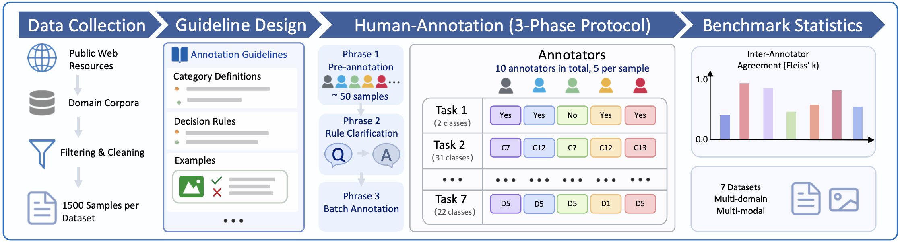
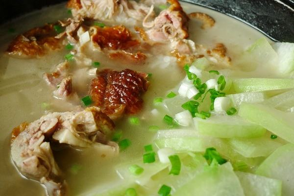
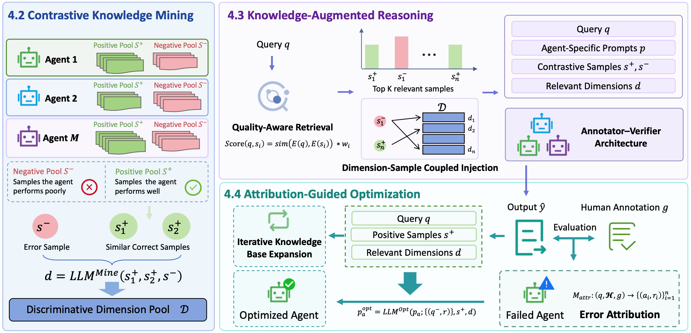

# 🏷️ ANT-A & ANT-OR

This project ships with **two parallel contributions**:
1. **ANT-A** — a **benchmark** of 7 real-world annotation tasks (10,500 samples, 5 annotators each), covering text and multimodal modalities and preserving full label distributions instead of a single "gold" label.
2. **ANT-OR** — an **optimization framework** using multi-agent optimization with agent-level contrastive knowledge, evaluated against single- and multi-agent baselines (direct / CoT / ICL / SPO) on ANT-A.

---

## 📊 ANT-A Benchmark

The complete ANT-A Benchmark—including all seven tasks, Chinese and English
splits, annotation guidelines, and multimodal images—is available on
Hugging Face: **[xiapk7/ANT-A-Benchmark](https://huggingface.co/datasets/xiapk7/ANT-A-Benchmark)**.

```python
from datasets import load_dataset

dataset = load_dataset(
    "xiapk7/ANT-A-Benchmark",
    "billing_scenario_classification",
    split="en",
)
```



### At a glance

7 tasks · 10,500 samples total · 5 independent annotators per sample · ships in Chinese (original) and English (translated).

| Task | Modality | Description | Output type |
|---|---|---|---|
| `billing_scenario_classification` | text | Billing scenario classification | single label |
| `disease_privacy_assessment` | text | Disease privacy compliance assessment | binary (Yes / No) |
| `entity_extraction` | text | Medical entity extraction | list of typed spans |
| `social_text_classification` | text | Social media text classification | single label |
| `image_classification` | image | Category / subcategory / guidance analysis | hierarchical multi-label |
| `image_text_relevance` | image + text | Image–text relevance assessment | ordinal score |
| `image_attribution_recognition` | image | Image attribute recognition | binary |

### What makes this benchmark interesting

- **Full label distribution preserved.** All 5 annotations kept per sample — no forced majority vote — supporting research on soft labels and annotator disagreement.
- **Wide difficulty spectrum.** Inter-annotator agreement ranges from 90% (billing) to 22% (social text), so a single framework must handle both ends.
- **Real rule documents shipped.** Each task includes the actual annotation guide (34–467 lines), making it a *rule-grounding* problem and a fair playground for prompt-optimization methods (SPO, ANTOR).
- **Production-sourced, not synthesized.** Medical privacy, billing, content moderation, e-commerce image understanding, image–text relevance.

### Annotator agreement (English benchmark, n = 1,500 per task)

| Task | Full agreement (5/5) | Majority (3–4/5) | No majority |
|---|---:|---:|---:|
| `billing_scenario_classification` | 90.1% | 9.7% | 0.2% |
| `image_text_relevance` | 75.9% | 23.9% | 0.3% |
| `image_attribution_recognition` | 56.4% | 42.5% | 1.1% |
| `disease_privacy_assessment` | 52.4% | 47.5% | 0.1% |
| `entity_extraction` | 45.2% | 37.4% | 17.4% |
| `image_classification` | 35.5% | 50.3% | 14.2% |
| `social_text_classification` | 21.7% | 51.2% | 27.1% |

### Sample schema

Each sample is a JSON object: `{query, annotation_1, …, annotation_5}` (multimodal tasks additionally carry an `image_url` field). Annotations are preserved verbatim; no aggregation is applied in the data file.

<details>
<summary><b>Example — disease_privacy_assessment</b> (3/5 disagreement)</summary>

```json
{
  "query": "Sex reversal syndrome",
  "annotation_1": "Yes", "annotation_2": "Yes", "annotation_3": "No",
  "annotation_4": "Yes", "annotation_5": "No"
}
```
</details>

<details>
<summary><b>Example — image_text_relevance</b> (split 3 / 2 on ordinal scale)</summary>



```json
{
  "query": "Duck head soup",
  "image_url": "./images/duck_soup.png",
  "annotation_1": "2 points", "annotation_2": "1 point", "annotation_3": "1 point",
  "annotation_4": "1 point",  "annotation_5": "2 points"
}
```
</details>

### Notes on the data
- **Language.** Original annotations are in Chinese; an English-translated benchmark is also shipped.
- **Privacy.** All personal-privacy data has been anonymized.
- **Complete release.** Download the full benchmark, including the images referenced by the three multimodal tasks, from [Hugging Face](https://huggingface.co/datasets/xiapk7/ANT-A-Benchmark).

In this repository, each task lives under `benchmark/<task_type>/` with:
- `*_parsed_zh.json` / `*_parsed_en.json` — parsed annotations
- `*_rules_zh.md` / `*_rules_en.md` — the original annotation rule document

---

## ⚙️ ANT-OR



### Installation

```bash
pip install openai numpy pandas pillow requests tiktoken
pip install opencv-python imagehash   # only needed for ICL image similarity fallback
```

### Configuration

Edit `utils/call_llm_api.py` to point at your LLM endpoint:

```python
API_BASE_URL = "https://your-api-endpoint.com/v1"
API_KEY = "your-api-key"
```

### Methods

| Method | Optimization? | Description |
|---|---|---|
| **single-agent direct** | no | Single LLM, direct answer (no CoT) |
| **single-agent CoT** | no | Single LLM, chain-of-thought prompt |
| **single-agent ICL** | no | Single LLM with in-context examples retrieved from a pool |
| **multi-agent CoT** | no | 3 annotators + aggregator + verifier (no ICL) |
| **multi-agent CoT+ICL** | no | Multi-agent with ICL example retrieval |
| **single-agent SPO** | yes | Vanilla SPO optimizes the rule document, then CoT evaluation |
| **multi-agent SPO** | yes | SPO optimizes multi-agent prompts, then multi-agent evaluation |
| **ANTOR** | yes | Multi-agent optimization with contrastive knowledge injection + final evaluation |

### Usage

Six shell scripts under `scripts/`. All accept `[output_file_prefix]` and `[model]` as optional positional args (defaults shown below).

#### Single-task

```bash
# Single-agent baseline evaluation (direct / cot / icl)
bash scripts/run_eval_single.sh <task_type> [mode] [prefix] [model]
# mode default: cot

# Multi-agent baseline evaluation
bash scripts/run_eval_multi.sh <task_type> [use_icl] [prefix] [model]
# use_icl: 0|1, default 0 (pure CoT)

# Single-agent SPO pipeline (optimize + evaluate)
bash scripts/run_spo_single.sh <task_type> [prefix] [model]

# Multi-agent SPO pipeline
bash scripts/run_spo_multi.sh <task_type> [prefix] [model]

# ANTOR pipeline (optimize + evaluate). Optional 4th arg = resume_epoch.
bash scripts/run_antor.sh <task_type> [prefix] [model] [resume_epoch]
```

Default model is **task-aware**: text-only tasks default to `DeepSeek-V3.1-Terminus`, multimodal tasks default to `Qwen3-VL-235B-A22B-Instruct`. Override by passing the 4th positional arg (`run_eval_*`) or 3rd (`run_spo_*` / `run_antor`).

#### Examples

```bash
bash scripts/run_antor.sh image_classification v1 Qwen3-VL-235B-A22B-Instruct
```

#### Batch run (all 7 tasks)

```bash
bash scripts/run_all_tasks.sh <method> [prefix] [model]
```

Valid `<method>` values:

```
eval_single_direct   eval_single_cot   eval_single_icl
eval_multi_cot       eval_multi_icl
spo_single           spo_multi         antor
```

Example:

```bash
bash scripts/run_all_tasks.sh eval_single_cot baseline
```
